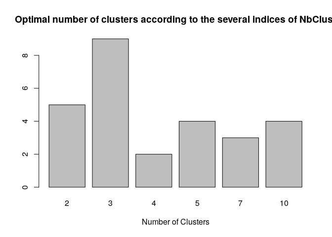

## Find optimal number of clusters

Use NbClust to select the optimal number of clusters according to
multiple suitability measuring criteria

Load dataset from file.

    M <- read.csv2('data/full-data.csv', sep = ',')

Select records belonging to a single problem and exclude non-accepted
solutions.

    E <- M %>%
      filter(result == 0) %>%
      filter(problem_id == 21) %>% # change problem ID here
      filter(language == 'PYTHON') # change language here

Exclude identifying columns and convert character columns to numeric.

    E <- E %>%
      select(-c(problem_id, submission_id, language, result)) %>%
      mutate_if(is.character, as.numeric)

Select the feature set to use.

    E <- E %>%
      select(c(connected_components, loop_statements, conditional_statements,
               cycles, avg_node_degree, avg_clust_coeff_node,
               avg_avg_degree_node_neighbors, eg1, eg2, eg3))

As our evaluation will also draw two graphs, we reduce default margins
of figures to accommodate them, else we get errors. ‘mar’ sets margins
of figures drawn by NbClust. par is a general function in base R to set
ALL figure parameters like margins (mar), fig size, no of figures etc

    par(mar = c(2,2,2,2))    #  Set margins as: c(bottom, left, top, right)

NbClust measures appropriateness of cluster on a number of indices.
These are:

1.  kl (Krzanowski and Lai 1988)
2.  ch (Calinski and Harabasz 1974)
3.  hartigan (Hartigan 1975)
4.  ccc (Sarle 1983)
5.  scott (Scott and Symons 1971)
6.  marriot (Marriot 1971)
7.  trcovw (Milligan and Cooper 1985)
8.  tracew (Milligan and Cooper 1985)
9.  friedman (Friedman and Rubin 1967)
10. rubin (Friedman and Rubin 1967)
11. cindex (Hubert and Levin 1976)
12. db (Davies and Bouldin 1979)
13. silhouette (Rousseeuw 1987)
14. duda (Duda and Hart 1973)
15. pseudot2 (Duda and Hart 1973)
16. beale (Beale 1969)
17. ratkowsky (Ratkowsky and Lance 1978)
18. ball (Ball and Hall 1965)
19. ptbiserial (Milligan 1980, 1981)
20. gap (Tibshirani et al. 2001)
21. frey (Frey and Van Groenewoud 1972)
22. mcclain (McClain and Rao 1975)
23. gamma (Baker and Hubert 1975)
24. gplus (Rohlf 1974) (Milligan 1981)
25. tau (Rohlf 1974) (Milligan 1981)
26. dunn (Dunn 1974)
27. hubert (Hubert and Arabie 1985)
28. sdindex (Halkidi et al. 2000)
29. dindex (Lebart et al. 2000)
30. sdbw (Halkidi and Vazirgiannis 2001)

As some indices may fail to calculate, we try to compute these indices
one by one using NbClust. For each of them, NbClust indicates the
optimal number of clusters. By default, it checks from 2 clusters to 16
clusters.

    indices <- c(
      "kl", "ch", "hartigan", "ccc", "scott", "marriot", "trcovw", "tracew", 
      "friedman", "rubin", "cindex", "db", "silhouette", "duda", "pseudot2", 
      "beale", "ratkowsky", "ball", "ptbiserial", "gap", "frey", "mcclain", "gamma",
      "gplus", "tau", "dunn", "hubert", "sdindex", "dindex", "sdbw"
    )
    results <- list()
    for (i in 1:length(indices)) {
      results[[i]] <- tryCatch(
        expr = {
            NbClust(E, min.nc=min(length(E), 2), max.nc=min(length(E), 16), method="complete", index=indices[i])$Best.nc[[1]][1]
        },
        error = function(e){
          print(e)
            return(NA)
        }
      )
    }

    ## *** : The Hubert index is a graphical method of determining the number of clusters.
    ##                 In the plot of Hubert index, we seek a significant knee that corresponds to a 
    ##                 significant increase of the value of the measure i.e the significant peak in Hubert
    ##                 index second differences plot. 
    ## 

    ## *** : The D index is a graphical method of determining the number of clusters. 
    ##                 In the plot of D index, we seek a significant knee (the significant peak in Dindex
    ##                 second differences plot) that corresponds to a significant increase of the value of
    ##                 the measure. 
    ## 

    # remove NAs
    results <- results[!is.na(results) & !sapply(results, is.null)]

    # simplify list to vector and remove invalid clusters number (<=1)
    results <- unlist(results, use.names = FALSE)[results > 1]

Draw a histogram denoting how various indices have voted for number of
clusters. The most voted number of clusters is the optimal.

    barplot(
      table(results),
      xlab = 'Number of Clusters',
      main = 'Optimal number of clusters according to the several indices of NbClust'
    )

## Building PCA Summary

### Summary

    E.pca <- prcomp(E[,!(names(E) %in% c("problem_id", "submission_id", "language", "result"))], center = TRUE, scale = TRUE)

    summary(E.pca)

    ## Importance of components:
    ##                           PC1    PC2    PC3     PC4     PC5     PC6     PC7
    ## Standard deviation     2.2954 1.3807 1.2383 0.65674 0.59318 0.44187 0.39588
    ## Proportion of Variance 0.5269 0.1906 0.1533 0.04313 0.03519 0.01952 0.01567
    ## Cumulative Proportion  0.5269 0.7175 0.8709 0.91402 0.94920 0.96873 0.98440
    ##                            PC8    PC9    PC10
    ## Standard deviation     0.29694 0.2074 0.15754
    ## Proportion of Variance 0.00882 0.0043 0.00248
    ## Cumulative Proportion  0.99322 0.9975 1.00000

### Observation

As per the summary above (Importance of components); the first 4
variables contribute to more than 90% of the information required for
the entire data. Hence the 10 components can be reduced to 4 for further
analysis with 90% information.

    fviz_eig(E.pca, addlabels = TRUE)

    plot(E.pca, main = "Explained Variance per Principal Component")

    biplot(E.pca)

## Cluster Analysis - PCA Suggested Components

### Find optimal number of clusters

    E_pca <- as.data.frame(E.pca$x[,1:4])
    results <- list()
    for (i in 1:length(indices)) {
      results[[i]] <- tryCatch(
        expr = {
            NbClust(E_pca, min.nc=2, max.nc=16, method="complete", index=indices[i])$Best.nc[[1]][1]
        },
        error = function(e){
          print(e)
            return(NA)
        }
      )
    }

    ## *** : The Hubert index is a graphical method of determining the number of clusters.
    ##                 In the plot of Hubert index, we seek a significant knee that corresponds to a 
    ##                 significant increase of the value of the measure i.e the significant peak in Hubert
    ##                 index second differences plot. 
    ## 

    ## *** : The D index is a graphical method of determining the number of clusters. 
    ##                 In the plot of D index, we seek a significant knee (the significant peak in Dindex
    ##                 second differences plot) that corresponds to a significant increase of the value of
    ##                 the measure. 
    ## 

    # remove NAs
    results <- results[!is.na(results) & !sapply(results, is.null)]

    # simplify list to vector and remove invalid clusters number (<=1)
    results <- unlist(results, use.names = FALSE)[results > 1]

    barplot(
      table(results),
      xlab = 'Number of Clusters',
      main = 'Optimal number of clusters according to the several indices of NbClust',
    )

### K-Means clustering

### 2 Clusters

    km = eclust(E_pca, "kmeans", k = 2, graph = F, stand = T)
    fviz_cluster(km, geom = "point", ellipse = T, ellipse.type = "norm")

### 3 Clusters

    km = eclust(E_pca, "kmeans", k = 3, graph = F, stand = T)
    fviz_cluster(km, geom = "point", ellipse = T, ellipse.type = "norm")

